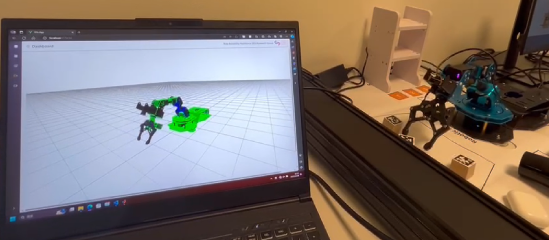

<p align="center">
  <a>
    
  </a>

  <h3 align="center">Digital failure twins for reliability and predictive maintenance </h3>

  <p align="center">
    A repository that presents a digital twin model for a robot and how to use it for 
    <br>
    failure simulation, reliability modeling, and predictive maintenance.
    <br>
    <a href="https://github.com/sonic160/digital_twin_robot/issues">Bugs and issues</a>
    ·
    <a href="https://github.com/sonic160/digital_twin_robot/discussions">Discussions</a>
  </p>
</p>

<!-- ALL-CONTRIBUTORS-BADGE:START - Do not remove or modify this section -->
[](#contributors-)
<!-- ALL-CONTRIBUTORS-BADGE:END -->

## Quick start

Below are a few tutorials that help you get started with this repository.
- Digital twins:
  - [A matlab application for condition-monitoring of a robot](documents/cm_matlab_ros/how_to_use_condition_monitoring_app.md)
  - A digital shadow that synchronizes the digital twin model with the real robot (to be updated)
  - Trajectory simulation model in Matlab (to be updated)
  - Trajectory planning model in MoveIt (to be updated)
- Reliability and predictive maintenance based on digital twin:
  - Training a deep learning model based on digital twin for fault diagnosis (to be updated)
  - Using digital twin to detect the temperature drift of the robot motors ([see this data challenge](https://www.kaggle.com/competitions/robot-predictive-maintenance))

## Development status

This project is currently under development. The final objectives are to create open source digital twin model of a robot and codes and tutorials on how to use the digital twin model for failure simulation, reliability modeling, and predictive maintenance.

Below is a list of new features that we are working on right now:
- Add a functionality to simulate the temperature and voltage in the digital twin model.
- Add a use case and tutorial of using the digital twin model to train and fine-tune a machine learning model to predict the failure of the real robot.

## What's included

The main parts of this repository is organized as follows:

```text
└── robot_digital_twin: This folder contains the digital twin model for the robot.
    └── 3d_model_urdf_files: 3D model of the robot in URDF format.
    └── catin_ws: A copy of the catkin workspace on the robot. It contains the source codes on the robot side that are related to this repository.
    └── condition_monitoring_matlab_ros: A matlab application for condition-monitoring.
    └── digital_shadow_python_ros (to be finished): A digital shadow (data flow from the robot to the model) developed in python.
    └── trajectory_simulation_matlab (to be finished): A matlab application for simulating trajectories.
    └── trajectory_simulation_moveit (to be finished): A moveit application for simulating trajectories.

└── documents: This folder contains the tutorials related to this project.

└── related_projects (to be finished): This folder contains the related projects.
```

## Contributing

You are welcome to contribute to this project. Please folk the repository, add a your own branch, make your changes on this branche, and submit a pull request. Please describe briefly what you have changed so that we can easily understand and review your changes.

## Copyright and license

Code and documentation copyright 2023- the authors. Code released under the [MIT License](LICENCE.md).

## Credits

This work is partially supported by the French Research Council (ANR) JCJC projct **Digital Failure Twin** under contract number ANR-22-CE10-0004.

This project benifits from the following open source projects:
- To be updated.

## Contributors ✨

Thanks goes to these wonderful people ([emoji key](https://allcontributors.org/docs/en/emoji-key)):

<!-- ALL-CONTRIBUTORS-LIST:START - Do not remove or modify this section -->
<!-- prettier-ignore-start -->
<!-- markdownlint-disable -->
<table>
  <tbody>
    <tr>
      <td align="center" valign="top" width="14.28%"><a href="https://github.com/sonic160"><br /><sub><b>sonic160</b></sub></a><br /><a href="#projectManagement-sonic160" title="Project Management">📆</a> <a href="https://github.com/sonic160/digital_twin_robot/commits?author=sonic160" title="Code">💻</a></td>
      <td align="center" valign="top" width="14.28%"><a href="https://github.com/SAGIRI-kawaii"><br /><sub><b>ZAPHAKIEL</b></sub></a><br /><a href="https://github.com/sonic160/digital_twin_robot/commits?author=SAGIRI-kawaii" title="Code">💻</a></td>
      <td align="center" valign="top" width="14.28%"><a href="https://github.com/thwtt"><br /><sub><b>Thomas W</b></sub></a><br /><a href="https://github.com/sonic160/digital_twin_robot/commits?author=thwtt" title="Code">💻</a></td>
      <td align="center" valign="top" width="14.28%"><a href="https://github.com/KillianMcCourt"><br /><sub><b>KillianMcCourt</b></sub></a><br /><a href="https://github.com/sonic160/digital_twin_robot/commits?author=KillianMcCourt" title="Code">💻</a></td>
      <td align="center" valign="top" width="14.28%"><a href="https://github.com/X1M1C1"><br /><sub><b>X1M1C1</b></sub></a><br /><a href="https://github.com/sonic160/digital_twin_robot/commits?author=X1M1C1" title="Code">💻</a></td>
    </tr>
  </tbody>
</table>

<!-- markdownlint-restore -->
<!-- prettier-ignore-end -->

<!-- ALL-CONTRIBUTORS-LIST:END -->

This project follows the [all-contributors](https://github.com/all-contributors/all-contributors) specification. Contributions of any kind welcome!
