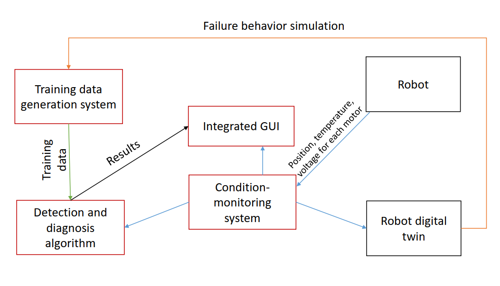

In this document, we will quickly recap the objectives of our course project. Based on this, you will find a summary of deliverables you need to submit before the submission deadline, and a detailed grading criteria for you to better prepare your work and final defense.

# Project objectives and work packages

## Title of the project

The title of this project is: Robot fault detection through real-time condition-monitoring

## Objectives:

The objective of this project is to develop a proof-of-concept prototype fault detection and diagnosis system for a education robot, based on real-time health-monitoring data collected from a condition-monitoring system. 

A schematic of the proof-of-concept prototype system is given in the Figure below. From the Figure, we can see that the main tasks in this project includes:

1. Develop a integrated condition-monitoring system that is able to:
    - Collect real-time health-monitoring data from the robot.
    - Interact with the fault detection and diagnosis system to make real-time fault detection and diagnosis decisions.
    - Visualize the results of condition-monitoring and fault detection/diagnosis in realtime.

2. Develop a fault detection and diagnosis system that is able to:
    - Analyze the collected health-monitoring data to detect potential faults.
    - Make real-time fault detection and diagnosis decisions based on the analysis results.
    - Send the result to the condition-monitoring system to visualize the results in realtime.

3. Develop a training data generation method, based on the condition-monitoring system and digital twin model of the robot, to train the fault detection and diagnosis system. This is optional if you feel that the dataset provided by us is sufficient.

## Form of the final evaluation

This project will be evaluated by the following activities:

1. You need to submit some deliverables to detail what you have done in this project, accoring to requirements in the next section. 
2. You will make a final defense.
    - You need to make a presentation of **20 mins**.
    - There will be a Q&A section for **10 mins**.
3. There is a data challenge, where you need to:
    - Generate test dataset to evaluate the other group;
    - Be evaluated based on the testing dataset generated by the other groups.

# Deliverables

1. The prototype application you developed for condition-monitoring and fault detection. Please name it as **'Prototype_Group_X.app'**. This application should have at least the following functions:
    - Collect the position, temperature and voltage for each motor in realtime.
    - Call the fault detection model and make the fault detection in realtime.
    - Visualize the results in realtime, and mark the data point as a red cross if a failure is detected.
    - Output the collected condition-monitoring data and the predicted label as a csv file.
    - You can use this example as a [baseline](<../WP3_Data challenge preparation/supports/fault_detection_evaluation/app_prototype_fault_detection_client.mlapp>). 
    - If you add some other functions compared to the baseline, you will receive a bonus.

2. A demonstration video of the application, highlighting its main functionality, with the robot. Please name it as **'Demo_Group_X.mp4'** (any video format is accepted).

3. A Jupyter notebook reporting the model development process, including but not limited to:
    - Data cleaning, preprocessing
    - The models you tried and their performance evaluation through cross validation on the training dataset.
    - The final model with best performance and its performance on the testing dataset.
    - Please name the notebook as **'notebook_group_X.ipynb'**.

3. The final fault detection model/models you developed. This model should be dumped into the disc and being able to used directly from your application, following this [tutorial](<../WP3_Data challenge preparation/supports/fault_detection_evaluation/how_to_run_fault_detection_model_from_Matlab.md>). Please name it as **'model_group_X.joblib'** (or any other supported formate).

4. The dataset you generated for the data challenge. After the data challenge, you the prediction results from your model. For the detailed formats, see the next section.

4. The slide of your final defense. Please name it as **'slide_group_X.pptx'**.

## How to submit and the deadline

For the data challenge, there are two phases:
- Phase 1: You need to generate a testing dataset to evaluate the other groups. The deadline for this phase is **2023-12-18 23:59:59**. You need to use this [application](<../WP3_Data challenge preparation/supports/data_collection/app_prototype_fault_detection_master.mlapp>) to generate the data (see the tutorial [here](<../WP3_Data challenge preparation/supports/data_collection/how_to_collect_data_with_injected_failure.md>)), and create a zip file of the six csv files generated, name it as **'testing_data_group_X.zip'**, and send me by email (zhiguo.zeng@centralesupelec.fr).

    You can generate the testing data either on our class of 14/12, or by making an appointment with me from [here.](https://cal.com/zhiguo-zeng-cs-upsclay/1h-meeting?duration=60&date=2023-12-14&month=2023-12)

- Phase 2: I will send each group the testing dataset you will be evaluated on, before 2023-12-19, 12:00 am. You need to evaluate your model based on it. To do this, you can use the fake robot ([code here](<../WP3_Data challenge preparation/supports/fault_detection_evaluation/fake_robot_send_true_data.m>), and [tutorial here](<../WP3_Data challenge preparation/supports/fault_detection_evaluation/how_to_run_fault_detection_model_from_Matlab.md>)). 

    To submit your results, you need to compress the six csv files generated by your prototype application, name it as **'prediction_results_group_X.zip'**, and send me by email (zhiguo.zeng@centralesupelec.fr). The deadline for this phase is **2023-12-19 23:59:59**.

    The results (F1 scores) of your model will be sent to you before 2023-12-20 12:00 am. You need to include this result in your final defense slide.

For the deliverables, i.e.,

1. 'Prototype_Group_X.app'
2. 'Demo_Group_X.mp4'
3. 'notebook_group_X.ipynb'
4. 'model_group_X.joblib'
5. 'slide_group_X.pptx'

You need to submit create a zip file named 'deliverables_group_X.zip', and send it by email (zhiguo.zeng@centralesupelec.fr) before the deadline of **2023-12-20 23:59:59**.

# Grading criteria

The grading criteria for this project is as follows:

1. Data challenge: 25%
    - Performance of your model (15%): Your model will be evaluted on a testing dataset generated by the other groups. We use the F1 score on the positive (failure) label to evaluate the performance of your model. 
    - Quality of the testing data set you generated (10%): The testing dataset generated by you will be used to evaluate the other groups. Its quality will be evaluated by the average F1 score from the groups who are tested on it. The lower this score is, the higher score you will get.

2. Prototype application: 25%
    - You will receive 18% of the points if you manage to satisfy the basic funtional requirements of the application based on the baseline application.
    - If your application has some additional functionality, you will receive extra points for them.

3. Jupyter notebook: 20%
    - The notebook should be well-organized and written in markdown format (5%)
    - Content of the notebook (20%) Please follow the provided [template](template_notebook.ipynb). In particular, you should demonstrate through this notebook that you are able to diagnose where is the problem that limits the performance of your model, and make improvements to the models accordingly.

4. Final defense: 30%
    - Quality, clarifty of the presentation and time-keeping (5%)
    - Appearance of the slide (5%)
    - Answer to the questions (5%)
    - Content of the presentation (15%)

    Blow, you can find a suggested outline for your slide:
    1. Introduction
        In this section, please quickly recap the main objectives and tasks of this project and give an overview of your presentation. 
    2. Protype of condition-monitoring and fault detection/diagnosis system
        - Present how do you design this prototype
        - Show a demostration video of the main functionality.
        - You need to demonstrate through your presentaton that:
            - your application satisified the basic functional requirements defined in Section "deliverables"
            - your additional functionality, if you have any.
    3. Model development
        In this section, please show the process of your model development. Please follow the outlines of the notebook templates.
    4. Results and discussions
        In this section, please show the performance of the different models you tried.

        Please also show the performance your best model could achieve on the data challenge.

        Please discuss why your model works well/not well, and propose some possiblity to further improve it.
    5. Conclusion
        - Summarize the major achievements in this project.
        - Summarize how do you attribute workloads among your group members.
        - Discuss what are the most challenges part of this project.
        - Discuss what do you think you learnt most from this project.
        - Do you use extensively the generative AI tools to help this project? If yes, please give some examples.
        - If we would like to improve the project for next year, do you have some suggestions?

