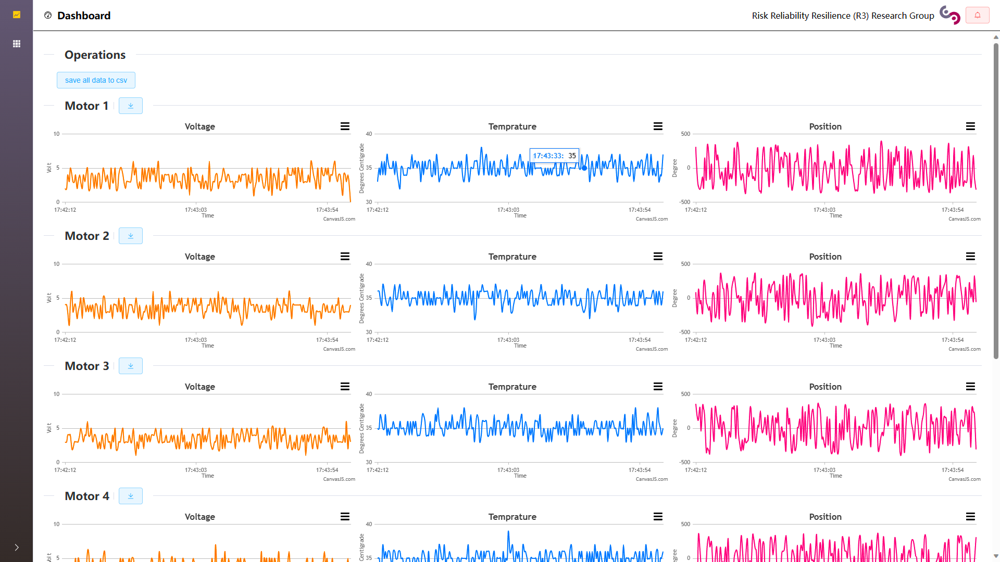

# digital_twin_robot

## How to use

- backend
1. Follow the instruction of [MatlabWebSocket](https://github.com/jebej/MatlabWebSocket) to install the package.
2. Open matlab, remember the port(Server(45708)'s port is 45708) and run main.m

- dashboard
1. Ensure that you have install the nodejs and npm in your system
2. Open the folder `monitor dashboard` and run `npm install`
3. Open main.js and modify line 38 to the port remembered at the backend step, e.g. ws://localhost:45708
4. run `npm run dev` and open in browser

- Demo
