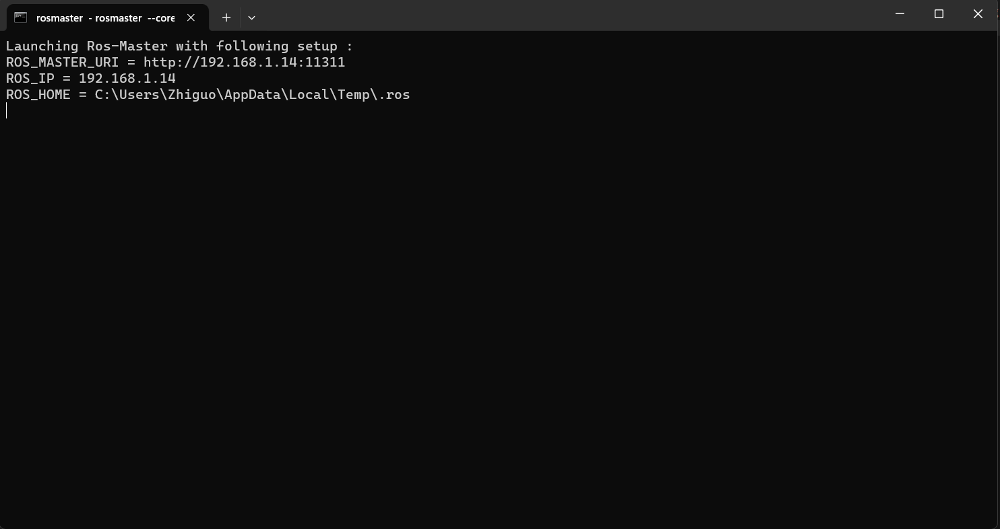
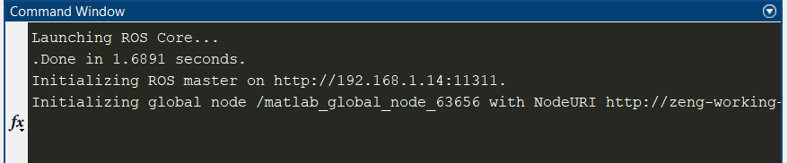
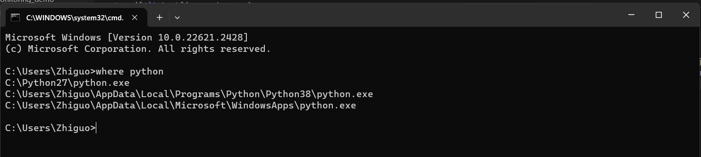
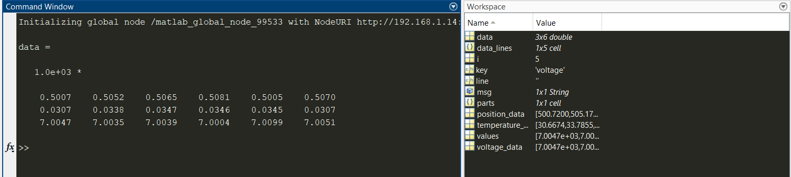

In this folder, you will find a demo of how to create a fake robot in Matlab so that you can test your program offline. To do so, you just need to run test_offline_start_fake_robot.m. If everything goes well, you should see a command line window poping up, like the following:

And the Matlab command window will like this:

Note that the 192.168.1.14 is the ip address of the generated robot. You will need to provide this address to the "rosinit" command in your client program. This generated robot will mimic the behavior of the real robot, i.e., publish condition-monitoring data (fake one) in the topic "/condition-monitoring" at a rate of $10$ Hz. 

It could be possible that during your first run, Matlab will ask you to specify dictionary of your python installation. You just need to follow the instruction and provide the necessary python path. If you are not sure what is the path of your python installation, you can open command line window, and use the commond "where python".

Once the fake robot is created, you need to keep this matlab terminal open, and open another matlab terminal as client to test your program (simply click again the Matlab shortcut). As an example, you can run either test_offline_echo.m or test_offline_subscriber.m in the new matlab terminal. This will create a rosnode and connect to the ros master created in the first Matlab terminal:
- For test_offline_echo.m, you will see the results like this:

- For test_offline_subscriber.m, you will see the results like this:

as this program creates a ros subscriber that automatically receive the message generated by the fake robot in topic "/condition-monitoring". To end the ros subscriber, first press "Ctrl + c" in the Matlab command window, and then enter "rosshutdown" in the Matlab command window.

Please note that you need to replace the ip address in the command "rosinit" to the ip adress of the generated fake robot.

When you finish testing your program, you need to end the fake robot manually: Go the first Matlab terminal, press "Ctrl + C" and then enter "rosshutdown" in Matlab command window.
