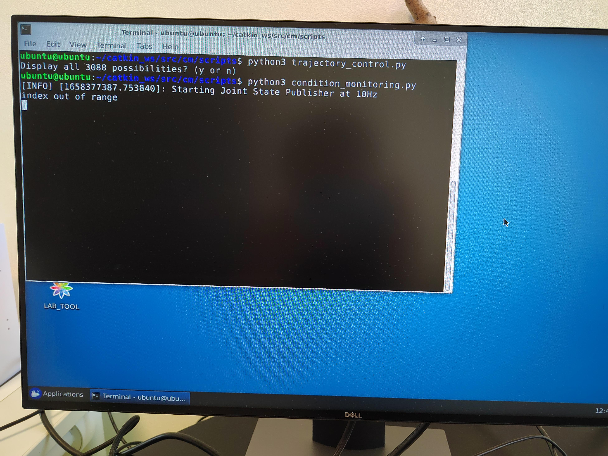

## Prepare the robot

This section shows how to prepare the robot to run the condition-monitoring application. If you would like to test the application without a real robot, refer to [this this document](create_a_robot_without_a_robot.md).

We developed a ROS package to read the status of each motor at a given frequency, and publish to a ros topic "condition_monitoring". The source code is: `robot_digital_twin\catkin_ws\cm\scripts\condition_monitoring.py`. 

**Please do not edit this file in Windows**, as the script will be run in Linux and the encoding protocal is different between Windows and Linux, which will cause the program to crash.

To start condition-monitoring on the robot side, you should follow the following steps:
1. Create a package "cm" in the catkin workspace of the robot, based on the files in the folder "/robot_digital_twin/catkin_ws/cm". For how to create a package, please refer to [this tutorial](http://wiki.ros.org/ROS/Tutorials/CreatingPackage).
    - Copy the files in the folder "/robot_digital_twin/catkin_ws/cm" to the package "cm".
    - Run "catkin_make" under the root dictionary of the catkin workspace.
    - Don't forget to source the setup file: `source ~/catkin_ws/devel/setup.bash`

2. Start a terminal on the robot side. Go to "cm/scripts/". Find the script "condition_monitoring.py" and make it executable:
```chmod +x condition_monitoring.py```

3. Start condition-monitoring:
```python3 condition_monitoring.py```

If successfully, you should see the following message on the robot's screen:
