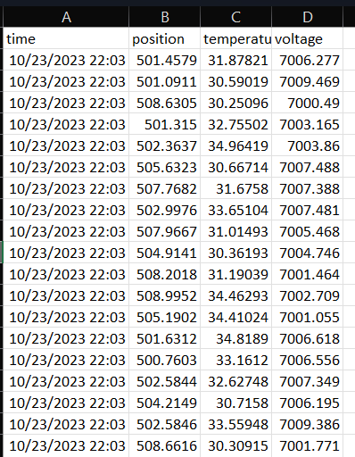

The application *app_prototype.mlapp* shows for a single motor (moter 1), how to:
1. Connect to the robot and read condition-monitoring data through defining a subscriber.
2. Extract the condition-monitoring data from the message from ROS.
3. Visualize in realtime the position, temperature and voltage.
4. Save the collected data in a .csv file.

To test it, you should follow the following steps:
1. Start the condition-monitoring program in the robot or create a fake robot for testing (for this, please refer to the tuturial [here](create_a_fake_robot_for_testing.md)).
2. Change the ip address in the rosinit function to the ip address of the actual or fake robot.
3. Click the *start* button to start data collection and data visualization. 
4. Click the *stop* button to save the collected data.

The program will visualize the collected data in realtime:

The collected data will be saved in the currect dictionary as a csv file as the following:

