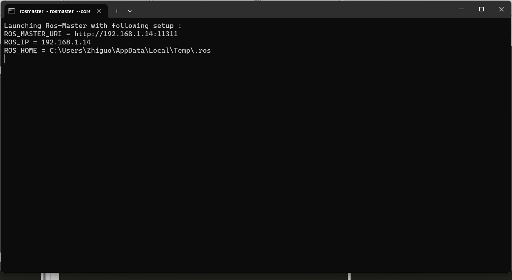
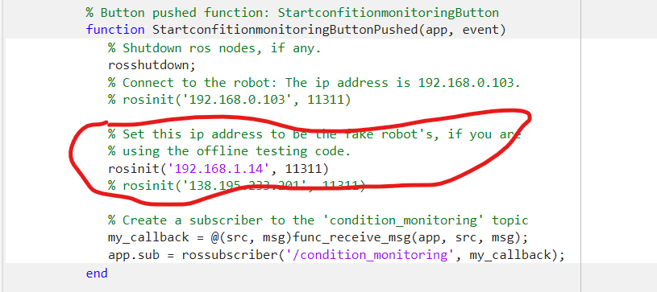

In this document, I will present a step-by-step guide on how to dump the fault detection model developed in Python as a `.joblib` file, load it into Matlab, and run the fault detection model in the condition-monitoring GUI for real-time fault detection. 

# Step 1: Dump the Fault Detection Model as a `.joblib` File

First, we need to dump the fault detection model as a `.joblib` file. This can be done by using the `joblib` package:
```python
import joblib
joblib.dump(model, 'model.joblib')
```

## Test it:

You can find a demo of how to train a simple logistic regression model and dump it as a `.joblib` file from [here.](../fault_detection_model_developement/create_a_simple_mdl.ipynb) This notebook trains a logistic regression model for motor $4$, and dump the model called `detection_mdl_motor_4.joblib` in `'WP3_Data_challenge preparation/supports/fault_detection_evaluation/'`.

# Step 2: Load the Fault Detection Model into Matlab

Next, we need to load the dumped `.joblib` file into Matlab. To do this, we use the `pyrun` function in Matlab. This function allows executing a python script from within Matlab. For reference of this function, please check [here.](https://fr.mathworks.com/help/matlab/ref/pyrun.html)

In the Matlab application `app_prototype_fault_detection_client.app`, we load the fault detection model in the `startupFcn` function:

```matlab
function startupFcn(app)
    app.init_parameters()
    
    % Load the failure detection model in MATLAB
    pyrun('import numpy as np')
    app.fault_detection_mdl = pyrunfile('load_model.py', 'clf');
end
```

The python script `load_model.py` contains the following code:

```python
import joblib

# Load the fault detection model
clf = joblib.load('your_model.joblib')
```

and should be placed in the same folder as the `app_prototype_fault_detection_client.app` file.

## Test it:

To test it, you need to run the application `app_prototype_fault_detection_client.app`. The `startupFcn` function will be executed automatically when you run the application. If the model is loaded successfully, you will see the following message in the Matlab command window:
```
[INFO] - Successfully loaded the fault detection model.
```

__Notes:__

- Please note that to use the `pyrun` function in Matlab, you need to have Python version supported by Matlab installed. The supported versions can be checked from [here.](https://fr.mathworks.com/support/requirements/python-compatibility.html)If you Matlab version is R2023b, then, the supported python versions are 3.9, 3.10 and 3.11.
- You need to specify the path to your compliable python interpreter using `pyenv`: `pyenv(Version=path)` where `path` is the path to your python interpreter. To check the path, you can type `where python` in the command line terminal. It will list the paths of all installed python interpreters.

- If you got an error related to package installation, you can install the required packages using `pip`: `pip install joblib`. But you need to make sure you are installing to the correct python interpreter. For example, if you want to use python 3.11, you need to install the packages using `pip install joblib --target=C:\Users\Zhiguo\AppData\Local\Programs\Python\Python311\`.

# Step 3: Run the Fault Detection Model in the Condition-Monitoring GUI

In `app_prototype_fault_detection_client.app`, the loaded model can be used to detect faults in the real-time condition-monitoring GUI. To do this, we just need to modify the `saveAndPlotMotorData` function:

```matlab
function saveAndPlotMotorData(app, motor_id, plt_handles)                   
    % This function detects if a failure occurs at the current time, and
    % update the plots.

        % Get tnow.
        tnow = app.idx;

        % Make failure detection.
        % Prepare the feature.
        feature = app.data_motor(tnow, :, :);
        feature = feature(:);
        feature = pyrun('tmp = np.array(feature).reshape(1, -1)', 'tmp', feature=feature);
        % Run fault detection by calling the fault detection model,
        % trained in Python.
        pred_state = app.fault_detection_mdl.predict(feature);
        
        % Save the prediction and visualize the results.
        if pred_state == 0
            marker = '.b'; % Blue dot for normal samples
        else
            marker = 'xr'; % Red cross for failures
            app.is_failure_pred(app.idx, motor_id) = 1;
        end
```
In `app_prototype_fault_detection_client.app`, a Ros node is created when the application started and subscribed to the condition_monitoring topic. Whenever a new condition-monitoring message is received, the `saveAndPlotMotorData` function is called.

## Test it with a fake robot

Like in workpackage 1, we can test the fault detection model by running a fake robot. To do so:

1. Start a Matlab console.

2. Change the dictionary of the Matlab workspace into "WP3_Data challenge preparation/supports/fault_detection_evaluation/".

3. Open `fake_robot_send_true_data.m` and set the path and filenames of the condition-monitoring data you want the fake robot to sent. 


4. Run `fake_robot_send_true_data.m` to start the fake robot. If everything goes well, you should see a terminal poping up, like this:


5. Start a new Matlab console.

6. In the new Matlab console, open `app_prototype_fault_detection_client.app` and start the application. Please change the ip address of the Ros master according to what shows in the terminal before.


7. Choose the operation mode to be "Simulated robot" (It is selected by default), and click "start condition-monitoring".


8. The application will start to receive the condition-monitoring data from the fake robot. The collected data will be fed into the fault detection models. If a failure is detected, the data point will be plotted in red cross. The progrom will ends automatically when the all the data points in the testing dataset have been sent by the fake robot. The condition-monitoring data, as well as the prediction results, will be saved in the workspace and can be used to evaulate the performance of your algorithm later.

    __Note:__ The fake robot will keep sending the testing data recursively, i.e., if the sequnece finishes, it will start again from the beginning. The application will wait until the fake robot start sending a new sequence, and save only a complete seuqence and the predicted labels.